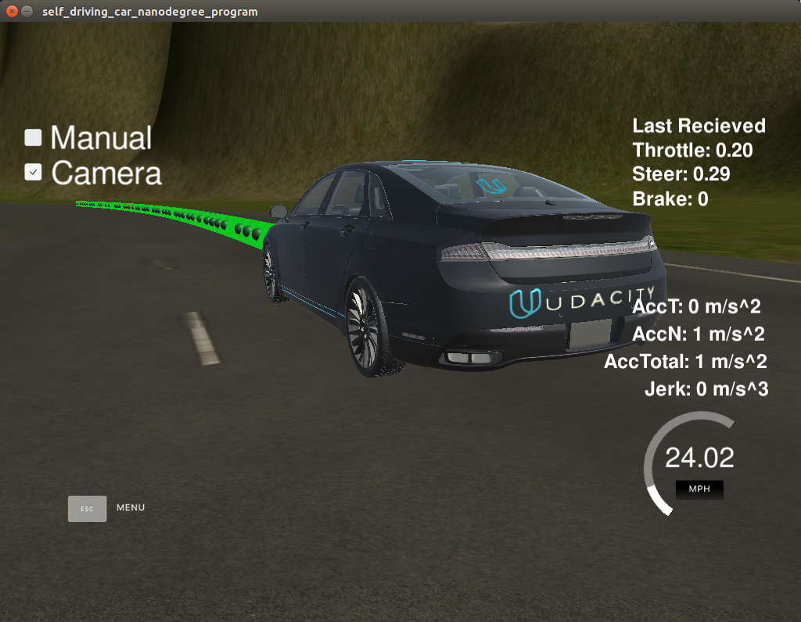
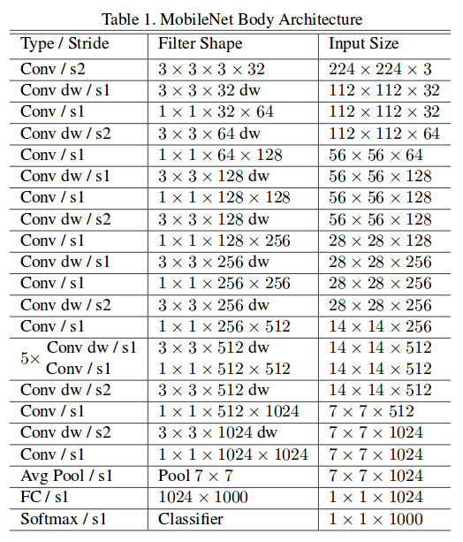
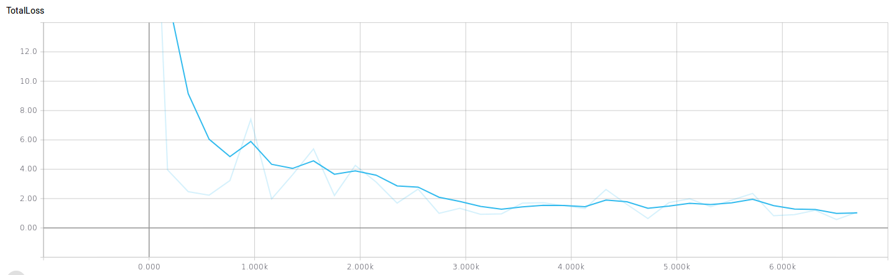
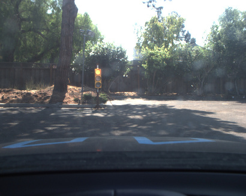
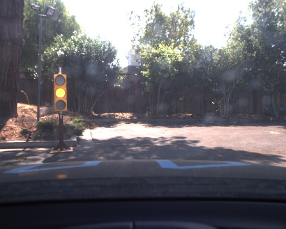
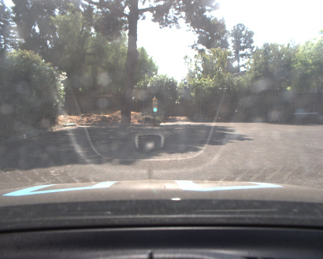

This is the project repo for the final project of the Udacity Self-Driving Car Nanodegree: Programming a Real Self-Driving Car. For more information about the project, see the project introduction [here](https://classroom.udacity.com/nanodegrees/nd013/parts/6047fe34-d93c-4f50-8336-b70ef10cb4b2/modules/e1a23b06-329a-4684-a717-ad476f0d8dff/lessons/462c933d-9f24-42d3-8bdc-a08a5fc866e4/concepts/5ab4b122-83e6-436d-850f-9f4d26627fd9).

# Team Mater
# Udacity Project CarND-Capstone
## Team Member
 * Stephan Meyer (skstm@web.de)
 * Ashok Singhal (wuffusg@gmail.com)
 * Marcin Mirosław (mbmiroslaw@gmail.com)
 * Ramesh Chukka (rnaidu02@gmail.com)
 * Renwei Wang (aimllifetime@gmail.com)

### Installing our solution

Please follow the **one** of the two installation options, either native **or** docker installation below
if you haven't initially install this project.

This code is build with python 2.7.12. Please make sure you use this python version when installing the project.

 1. Check out this repository
 2. in the root folder run `pip install -r requirements.txt` to install
   the necessary packages.

When you run the launch file you can set the `real_world_classifier` ROS parameter to `true` if you
want to use the classifier for the real world:
`rosparam set /real_world_classifier true`
Otherwise the simulator classifier is used.
Note that this parameter must be set *before* the tl_classifier.\_\_init\_\_ is called in order to load
the correct model.

## Our approach:

### Waypoint Updater
#### Following the Track
When the simulator starts up, it publishes a single (one-time) message to the `/base_waypoints` ros topic that specifies a series of waypoints that define the entire track that the car is expected to follow. Our code for the `waypoint_updater` node uses these base waypoints, along with the current pose (location and heading) of the car, to periodically update the `final_waypoints` ros topic with a list of `LOOKAHEAD_WPS = 100` waypoints that the car should follow, beginning with the waypoint immediately ahead of the car.

 

#### Efficiency Considerations
In order to update the `final_waypoints` at the desired frequency of 50Hz, we needed to pay attention to the efficiency of the `waypoint_updater` node.  Instead of doing a full deep copy of the entire list of waypoints at each update, since the car only moves a few waypoints at each step we instead only delete the few waypoints that it has just passed at the beginning of the previous list and append a few new waypoints at the end of the list. This speeds up calculation significantly.

#### Stopping at Red Traffic Lights
The waypoint list generated above for following the track must be adjusted to ensure that the car stops smoothly at red traffic lights.
If a traffic light is detected as red, the plan made so far is discarded and another plan is calculated to linearly reduce the velocity to reach 0 at the stop limit line in front of the traffic light.
For this we plan as many steps ahead of the car as are defined by an parameter
and never change the values anymore unless the state of the traffic light changes.
When the traffic light switches to green again, the stopping plan must again be overwritten with the
plan to follow the waypoints.

The plan is implemented to be computed linearly. This means we first compute a plan without including the
traffic lights and then apply a traffic light "filter" to the values in order to change them if a traffic
light was detected. This way the code stays linearly and other obstacles may be implemented in future
projects.

### Traffic light detection
For the traffic light detection we have 2 different use cases.
* The Simulator
* The real world

Both cases use a separately trained classifier.

#### Traffic light classifier for the Simulator
For the simulator traffic light classifier we use the following architecture:


Note that image is scaled to 1/4 the size of the camera image by scaling the width and height by 1/2 (300x400x3 instead of 600x800x3).  This reduces the model size substantially while still getting good quality predictions.

The first (lambda_1) stage of the model normalizes each channel.

This classifier classifies each incoming image as a whole to infer the state of the traffic light.

##### Data Collection for Training
To collect training data, the classifier code was modified so that instead of predicting the light state, it saves the camera images near traffic lights to files and the "ground truths" of the states of the traffic lights obtained from the simulator to a csv file.  The training code then uses this csv file to implement a generator to feed data to train the model.

The training data was collected by manually driving the car around the track several times with the classifier programmed to save data instead of classifying the light.  That way we could drive very slowly near traffic lights to collect images of the lights from various positions and in all three states.

We noticed that there is a delay after the "ground truth" changes and the change appears in the camera image.  Therefore, we manually corrected the "ground truth" in the csv file for images near light state transitions so that we train the model with correctly labelled images.

We found that this architecture is both light weight and robust to predict the traffic lights in the simulator.
Therefore this model is also checked in to this repository.

#### Real World traffic light detector
For the real world traffic light detector we used the
[object detection API](https://github.com/tensorflow/models/tree/master/research/object_detection) to
not start from scratch. We chose the MobileNet v1 detector because it is very light weight and therefore
fast during inference. Also it is currently one of the few classifiers that work with tensorflow 1.5.0
of the object detection API and tensorflow 1.3.0 of the car.
The architecture of the net is:


This general approach, was very well described by [Antony Sarkis](https://medium.com/@anthony_sarkis)
who created very nice blog posts about this issue.
The detector was pretrained on COCO dataset with 90 classes and fine tuned on a dataset made out of images
from the track: [dataset](https://drive.google.com/file/d/0B-Eiyn-CUQtxdUZWMkFfQzdObUE/view) This dataset
was also used and linked by [coldKnight](https://github.com/coldKnight/TrafficLight_Detection-TensorFlowAPI).
We trained the model until the loss converged:

After converging, we were able to get a training/validation accuracy of ~95.1%.
Here are the real world images that are classified with the real world classifier.

RED signal



 ('boxes: ', array([ 0.34669355,  0.37990823,  0.44469395,  0.40932181], dtype=float32))
('scores: ', 0.99921429)
('classes: ', 1.0)

ORANGE signal



('boxes: ', array([ 0.32945099,  0.18226181,  0.48397604,  0.23650797], dtype=float32))
('scores: ', 0.9009552)
('classes: ', 2.0)

GREEN signal



('boxes: ', array([ 0.38375774,  0.48111987,  0.42682913,  0.49595064], dtype=float32))
('scores: ', 0.95315224)
('classes: ', 3.0)

### The controllers

#### Steering controller
For steering we used the YawController which first calculated the angular velocity of the car and
weights that with the current velocity. After that it makes sure, that the angular velocity stays
within bounds of the max and min yaw rate of the car. The steering angle is then calculated according
to the current velocity of the car and the angular velocity.
The final steering angle is then low pass filtered for smoother driving

#### Velocity controller
For the velocity control we use a PID controller with
* v_kp = 0.2
* v_ki = 0.002
* v_kd = 0.005
and a min/max cap at -1 and 1 respectively.

The throttle values that the simulator expects are between 0 and 1, so the positive PID control values can be directly used for the throttle.
If the proposed velocity is above a threshold of 1.5 the throttle is pushed up to the value the PID
controller puts out and the brake is set to 0. If the proposed velocity is below that threshold,
the car brakes and the throttle command is set to 0.

Since the simulator requires the brake value in units of torque (Nm) and we want to remain safely within the maximum deceleration limit, we compute the maximum allowable braking torque as follows:

`max_brake = decel_limit * mass * wheel_radius`

When applying the brake, we use 0.4 times the max_brake so that we are safely within the maximum deceleration allowed.

### Further Improvements

In this scenario the car behaves as expected. However in real scenarios there are many other things
that need to be considered. Unforeseen events can happen where the car needs to stop immediately.
Also other obstacles can occur on the track and the route might need to be recalculated. These
situations are not covered within the behavior of the car so far and would need to be implemented
in a future project.

Also for the behavior one need to implement a more general solution to the point of no return
in front of a traffic light. In particular, it needs to better handle the yellow light and to decide whether to stop before a traffic
light depending on it's current velocity and distance from the light. If the light changes to yellow when the car is near the light, the car must decide if it is fast enough to pass the intersection before the traffic light switches to red, and if so it should not brake but rather continue.

However this "point of no return" in the real world depends on many factors like the pace of
switching lights of the traffic light, the traffic around the car and of course the velocity of
the car. Including these factors would make a much smoother driving experience.

The traffic light detection also is simplified in many aspects in contrast to the "real world".
Currently we are only focusing of one traffic light in front of the car. We assume that this traffic
light faces the car and is upright. In reality many traffic lights can occur in various shapes and at
various positions and some might only be relevant for cars in other lanes. In this project we abstract
from this variety of traffic lights.

Further more we currently use 2 separate classifiers for traffic light detection. We separated the tasks
because the traffic lights in the simulator are quite different from the real world traffic light.
If one puts more effort in training and generalising one classifier it might be possible to use just
one classifier for both scenarios.


Please use **one** of the two installation options, either native **or** docker installation.

### Native Installation

* Be sure that your workstation is running Ubuntu 16.04 Xenial Xerus or Ubuntu 14.04 Trusty Tahir. [Ubuntu downloads can be found here](https://www.ubuntu.com/download/desktop).
* If using a Virtual Machine to install Ubuntu, use the following configuration as minimum:
  * 2 CPU
  * 2 GB system memory
  * 25 GB of free hard drive space

  The Udacity provided virtual machine has ROS and Dataspeed DBW already installed, so you can skip the next two steps if you are using this.

* Follow these instructions to install ROS
  * [ROS Kinetic](http://wiki.ros.org/kinetic/Installation/Ubuntu) if you have Ubuntu 16.04.
  * [ROS Indigo](http://wiki.ros.org/indigo/Installation/Ubuntu) if you have Ubuntu 14.04.
* [Dataspeed DBW](https://bitbucket.org/DataspeedInc/dbw_mkz_ros)
  * Use this option to install the SDK on a workstation that already has ROS installed: [One Line SDK Install (binary)](https://bitbucket.org/DataspeedInc/dbw_mkz_ros/src/81e63fcc335d7b64139d7482017d6a97b405e250/ROS_SETUP.md?fileviewer=file-view-default)
* Download the [Udacity Simulator](https://github.com/udacity/CarND-Capstone/releases).

### Docker Installation
[Install Docker](https://docs.docker.com/engine/installation/)

Build the docker container
```bash
docker build . -t capstone
```

Run the docker file
```bash
docker run -p 4567:4567 -v $PWD:/capstone -v /tmp/log:/root/.ros/ --rm -it capstone
```

### Port Forwarding
To set up port forwarding, please refer to the [instructions from term 2](https://classroom.udacity.com/nanodegrees/nd013/parts/40f38239-66b6-46ec-ae68-03afd8a601c8/modules/0949fca6-b379-42af-a919-ee50aa304e6a/lessons/f758c44c-5e40-4e01-93b5-1a82aa4e044f/concepts/16cf4a78-4fc7-49e1-8621-3450ca938b77)

### Usage

1. Clone the project repository
```bash
git clone https://github.com/udacity/CarND-Capstone.git
```

2. Install python dependencies
```bash
cd CarND-Capstone
pip install -r requirements.txt
```
3. Make and run styx
```bash
cd ros
catkin_make
source devel/setup.sh
roslaunch launch/styx.launch
```
4. Run the simulator

### Real world testing
1. Download [training bag](https://s3-us-west-1.amazonaws.com/udacity-selfdrivingcar/traffic_light_bag_file.zip) that was recorded on the Udacity self-driving car.
2. Unzip the file
```bash
unzip traffic_light_bag_file.zip
```
3. Play the bag file
```bash
rosbag play -l traffic_light_bag_file/traffic_light_training.bag
```
4. Launch your project in site mode
```bash
cd CarND-Capstone/ros
roslaunch launch/site.launch
```
5. Confirm that traffic light detection works on real life images