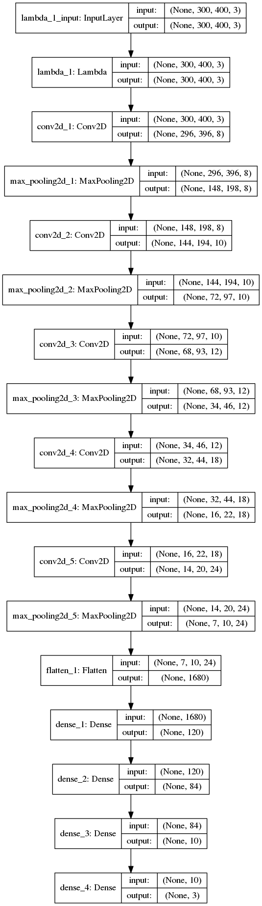
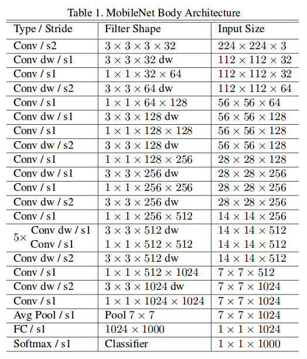

This is the project repo for the final project of the Udacity Self-Driving Car Nanodegree: Programming a Real Self-Driving Car. For more information about the project, see the project introduction [here](https://classroom.udacity.com/nanodegrees/nd013/parts/6047fe34-d93c-4f50-8336-b70ef10cb4b2/modules/e1a23b06-329a-4684-a717-ad476f0d8dff/lessons/462c933d-9f24-42d3-8bdc-a08a5fc866e4/concepts/5ab4b122-83e6-436d-850f-9f4d26627fd9).

# Team Mater Udacity Project CarND-Capstone
## Team Member
 * Stephan Meyer
 * Ashok Singhal
 * Marcin Mirosław
 * Ramesh Chukka 
 * Renwei Wang
 
### Installing our solution
 
 This code is build with python 2.7.12. Please make sure you use this python version when installing the project.
 
 1. Check out this repository
 2. in the root folder run `pip install -r requirements.txt` to install
   the necessary packages.

## Our approach:

### Waypoint following

In order for the car to stay on the track it has to follow a given trajectory.
This trajectory is made of waypoints that are fix for the whole track. The car therefore drives
by following the waypoints.

Besides calculating the next waypoints to come, it's important to keep the efficiency of the code in mind.
 Simply deep copying the waypoint nodes is way to slow for a 50Hz broad cast. To overcome this issue we use
 a separte list which is filled once initially and is updated every time another car position is received
 and the next way point is behind the car.
 This way we only need to adjust the front and the end of the waypoint queue, which speeds up calculation 
 significantly.
 
Furthermore the the plan made must be adjusted, once a red traffic light is detected. If a traffic light 
is detected as red, the plan made so far is thrown away and another plan is calculated to gradually stop
the car at the stop lane. 
The velocity is linearly reduced to reach 0 at the stop lane in front of the traffic
light.
For this we plan as many steps ahead of the car as are defined by an parameter 
and never change the values anymore unless the state of the traffic light changes.
When the traffic light switches to green again, the stopping plan must again be overwritten with the
plan to follow the waypoints.

The plan is implemented to be computed linearly. This means we first compute a plan without including the 
traffic lights and then apply a traffic light "filter" to the values in order to change them if a traffic 
light was detected. This way the code stays linearly and other obstackles may be implemented in future
projects.

### Traffic light detection
For the traffic light detection we have 2 different use cases.
* The Simulator
* The real world

Both use cases need a separately trained classifier.

#### Traffic light classifier for the Simulator
For the simulator traffic light classifier we use the following architecture:


This classifier classifies each incoming image as a whole to infer the state of the traffic light.
We trained this classifier solely a self produced data set of the images from the simulator. We found
that this architecture is both light weight and robust to predict the traffic lights in the simulator.
Therefore this model is also checked in to this repository.

#### Real World traffic light detector
For the real world traffic light detector we used the 
[object detection API](https://github.com/tensorflow/models/tree/master/research/object_detection) to 
not start from scratch. We chose the mobile net detector because it is very light weight and therefore
fast during inference. Also it is currently one of the few classifiers that work with tensorflow 1.5.0
of the object detection API and tensorflow 1.3.0 of the car.
The architecture of the net is:

This general approach, was very well described by [Antony Sarkis](https://medium.com/@anthony_sarkis) 
who created very nice blog posts about this issue.
The detector was pretrained on COCO dataset with 90 classes and fine tuned on a dataset made out of images
from the track: [dataset](https://drive.google.com/file/d/0B-Eiyn-CUQtxdUZWMkFfQzdObUE/view) This dataset
was also used and linked by [coldKnight](https://github.com/coldKnight/TrafficLight_Detection-TensorFlowAPI). 

### The controllers


### Further implementations

* point of no return depending on the velocity and traffic light state
* more general implementation of traffic light detection


Please use **one** of the two installation options, either native **or** docker installation.

### Native Installation

* Be sure that your workstation is running Ubuntu 16.04 Xenial Xerus or Ubuntu 14.04 Trusty Tahir. [Ubuntu downloads can be found here](https://www.ubuntu.com/download/desktop).
* If using a Virtual Machine to install Ubuntu, use the following configuration as minimum:
  * 2 CPU
  * 2 GB system memory
  * 25 GB of free hard drive space

  The Udacity provided virtual machine has ROS and Dataspeed DBW already installed, so you can skip the next two steps if you are using this.

* Follow these instructions to install ROS
  * [ROS Kinetic](http://wiki.ros.org/kinetic/Installation/Ubuntu) if you have Ubuntu 16.04.
  * [ROS Indigo](http://wiki.ros.org/indigo/Installation/Ubuntu) if you have Ubuntu 14.04.
* [Dataspeed DBW](https://bitbucket.org/DataspeedInc/dbw_mkz_ros)
  * Use this option to install the SDK on a workstation that already has ROS installed: [One Line SDK Install (binary)](https://bitbucket.org/DataspeedInc/dbw_mkz_ros/src/81e63fcc335d7b64139d7482017d6a97b405e250/ROS_SETUP.md?fileviewer=file-view-default)
* Download the [Udacity Simulator](https://github.com/udacity/CarND-Capstone/releases).

### Docker Installation
[Install Docker](https://docs.docker.com/engine/installation/)

Build the docker container
```bash
docker build . -t capstone
```

Run the docker file
```bash
docker run -p 4567:4567 -v $PWD:/capstone -v /tmp/log:/root/.ros/ --rm -it capstone
```

### Port Forwarding
To set up port forwarding, please refer to the [instructions from term 2](https://classroom.udacity.com/nanodegrees/nd013/parts/40f38239-66b6-46ec-ae68-03afd8a601c8/modules/0949fca6-b379-42af-a919-ee50aa304e6a/lessons/f758c44c-5e40-4e01-93b5-1a82aa4e044f/concepts/16cf4a78-4fc7-49e1-8621-3450ca938b77)

### Usage

1. Clone the project repository
```bash
git clone https://github.com/udacity/CarND-Capstone.git
```

2. Install python dependencies
```bash
cd CarND-Capstone
pip install -r requirements.txt
```
3. Make and run styx
```bash
cd ros
catkin_make
source devel/setup.sh
roslaunch launch/styx.launch
```
4. Run the simulator

### Real world testing
1. Download [training bag](https://s3-us-west-1.amazonaws.com/udacity-selfdrivingcar/traffic_light_bag_file.zip) that was recorded on the Udacity self-driving car.
2. Unzip the file
```bash
unzip traffic_light_bag_file.zip
```
3. Play the bag file
```bash
rosbag play -l traffic_light_bag_file/traffic_light_training.bag
```
4. Launch your project in site mode
```bash
cd CarND-Capstone/ros
roslaunch launch/site.launch
```
5. Confirm that traffic light detection works on real life images
